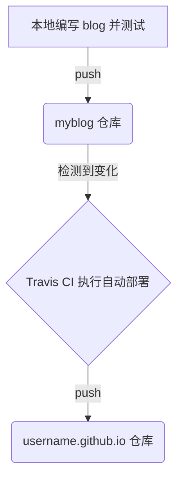

<!--more-->

关于什么是 Hugo 、为什么选择 Hugo 和 Github Pages，可以通过底部的参考文章或者网上搜索资料了解，这些都不是本文的重点，本文的主要目的在于将整个搭建过程的重要节点进行梳理，帮助大家完整快速的部署自己的博客。

Hugo 版本：v0.59.0

Hugo 官方地址：[https://gohugo.io/](https://gohugo.io/)

Github 地址：[https://github.com/gohugoio/hugo](https://github.com/gohugoio/hugo)

本次项目搭建的仓库地址：[https://github.com/juzl/my-blog](https://github.com/juzl/my-blog)

## Hugo 的安装与使用 (Windows 环境下)

### 准备工作

- 安装 Git
- 注册 Github 账户
- 下载 Hugo ，官方地址：[https://github.com/gohugoio/hugo/releases](https://github.com/gohugoio/hugo/releases)

### 安装 Hugo 

- 新建 `Hugo\bin` 和 `Hugo\Sites` 文件夹，将解压出来的可执行文件 (格式为 .exe) 放到 `bin` 目录下。

- 添加环境变量，`PATH` 下新增 `hugo.exe` 所在目录。

- 测试安装是否成功，命令 `hugo version`，出现如下类似提示表示成功。

  ```bash
  Hugo Static Site Generator v0.59.0-1DD0C69C windows/amd64 BuildDate: 2019-10-21T09:40:37Z
  ```

### hugo 常用命令与目录结构

| 命令名称                  | 参数                                                         | 功能描述                                    | 样例                 |
| :------------------------ | :----------------------------------------------------------- | ------------------------------------------- | -------------------- |
| hugo new site ${SITENAME} | ${SITENAME}，站点名称                                        | 创建一个新的 hugo 站点，并自动初始化        | hugo new site myblog |
| hugo server               | -D，编译 draft 内容，新 blog 默认是 draft 模式，不会生成内容，加上 -D 强制生成 blog 内容，主要用于本地预览 | 启动一个本地托管 server，可以预览 blog 内容 | hugo server -D       |
| hugo                      | 无                                                           | 编译静态内容进行发布                        | hugo                 |

当使用 `hugo new site` 命令时，hugo 会自动生成一个标准目录结构，如下：

```
#blog
#├── archetypes 
#│   └── default.md # 新建 blog 的模板文件可修改
#├── config.toml # 网站配置文件
#├── content # blog 内容文件
#├── data
#├── layouts
#├── static # 静态资源文件
#└── themes # 下载的主题目录
```

### 创建与配置 hugo 博客

```bash
# Hugo/Sites 目录下创建新的项目
hugo new site myblog

# 进入项目目录
cd myblog

# 安装主题，官网提供了主题区
git clone https://github.com/xiaoheiAh/hugo-theme-pure themes/pure

# 一般情况下，将主题的 config.toml 文件复制到项目根目录覆盖原文件，根据主题配置相应参数
# 注意，config.toml 文件中的 baseURL 地址应修改为你的 Github Pages 地址

# 创建第一篇 blog
hugo new post/my-first-blog.md

# 预览测试，在浏览器 http://localhost:1313 端访问本地服务
hugo server -D

# 测试没有问题后可以使用下面的命令进行发布，由于将要使用 Travis CI 的自动部署功能，所以本阶段准备暂时结束
hugo
```

## 部署到 Github Pages 与 Travis CI 自动部署

> 注意：本次搭建工作采用两个项目仓库的方式进行自动部署

### 建立代码仓库

确保 GitHub 上有这两个仓库，用来部署博客的 `username.github.io` 和 用来存放源码的 `myblog` ，自动部署的流程为：



### 申请 Token

在 [https://github.com/settings/tokens](https://github.com/settings/tokens ) 页面申请 Token，填写任意名字的注释，只需要勾选 `repo` 内容，点击页面最下方的  `Generate token` 生成 `Token`。


复制这个  `Token`，为设置 Travis 做准备。

> 注意：离开这个页面之后无法再次查该 `Token`


### 设置 Travis CI

打开 Travis CI 官方网站 https://travis-ci.com/](https://travis-ci.com/)， 使用 GitHub 帐号登录，选择需要托管的仓库。


点击 `Settings` ，在 `Environment Variables` 中填写刚才复制的 ·`Token`，变量名任意。


### 添加配置文件

在 myblog 目录下新增 `.travis.yml` 作为自动部署的配置脚本，其中 `${GITHUB_TOKEN}` 和 `${GITHUB_REF}` 可以根据自定义的变量名进行替换。

```yaml
language: go

go:
  - "1.12"

install:
  # 安装最新的hugo
  - wget https://github.com/gohugoio/hugo/releases/download/v0.59.0/hugo_0.59.0_Linux-64bit.deb
  - sudo dpkg -i hugo*.deb

script:
  # 运行hugo命令
  - hugo

after_script:
  # 部署
  - cd ./public
  - git init
  - git add .
  - git commit -m "Update Blog By TravisCI With Build $TRAVIS_BUILD_NUMBER"
  # Github Pages
  - git push --force --quiet "https://${GITHUB_TOKEN}@${GITHUB_REF}" master:master

env:
 global:
   # Github Pages
   - GITHUB_REF: github.com/juzl/juzl.github.io
```

添加完配置文件后，将 `myblog` 项目 push 至 Github 仓库，等待 Travis CI 的自动部署完成。


> 注意：建议在项目中添加  `.gitignore` 文件，忽略不需要上传的目录。

```
public/*
```

浏览器输入 `https://username.github.io` 访问搭建完成的博客。


## 参考文章：

1. 使用 Hugo + GitHub Pages 搭建个人博客 https://mogeko.me/2018/018/
2. 使用 Travis CI 自动部署 Hugo 博客 https://mogeko.me/2018/028/
3. 使用hugo搭建个人blog https://blog.voidmain.guru/posts/2019-07-01-blog-with-hugo/
4. 如何利用 GitHub Pages 和 Hugo 轻松搭建个人博客？https://www.jianshu.com/p/ca04631f4438
5. 使用 Hugo 搭建博客 https://segmentfault.com/a/1190000012975914
6. Hugo搭建博客<二>:使用Travis.ci自动部署到github pages和coding.net pages https://tainzhi.github.io/post/hugo%E6%90%AD%E5%BB%BA%E5%8D%9A%E5%AE%A22/